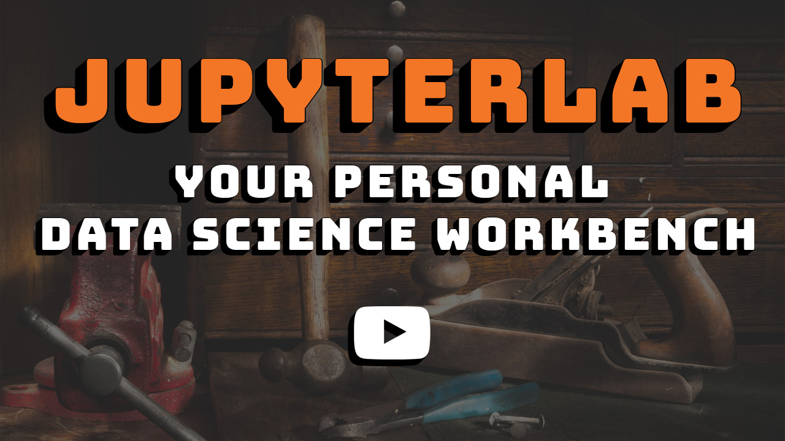

# JupyterLab - Your Personal Data Science Workbench

This presentation, given in March 2018 at [Full Stack Quants](http://fullstackquants.org/) London, introduces JupyterLab as a data science/research environment and shows off its most useful features. It also includes instructions for setting up your own instance of JupyterLab either locally or in the cloud on Amazon AWS.

Jupyter is an open-source web application that allows you to create and share documents that contain live code, equations, visualizations and narrative text. It's a great research environment for finance and machine learning applications.

The talk does not require extensive knowledge of Python, Jupyter or AWS. It aims to provide useful information for beginners as well as people who are already somewhat familiar with these technologies.

Below are links to the accompanying materials:

 * [**Presentation Slides**](https://rawgit.com/markusschanta/talks/master/2018-03%20-%20JupyterLab%20-%20Full%20Stack%20Quants/presentation.html)
 * [**Presentation Recording**](https://skillsmatter.com/skillscasts/11613-jupyterlab-your-personal-data-science-workbench)
 * [Example Notebooks](https://github.com/markusschanta/talks/tree/master/2018-03%20-%20JupyterLab%20-%20Full%20Stack%20Quants/notebooks) (available as interactive notebooks via [binder](https://mybinder.org/v2/gh/markusschanta/talks/master?urlpath=lab/tree/2018-03%20-%20JupyterLab%20-%20Full%20Stack%20Quants/notebooks))
 * [Setup Instructions](https://github.com/markusschanta/talks/blob/master/2018-03%20-%20JupyterLab%20-%20Full%20Stack%20Quants/setup.md)

## Further Resources

 * [jupyter/docker-stacks](https://github.com/jupyter/docker-stacks) - Stacks of ready-to-run Jupyter applications in Docker.
 * [jupyter.org](http://jupyter.org/) - Jupyter website.
 * [Jupyter Awesome List](https://github.com/markusschanta/awesome-jupyter) - A curated list of awesome Jupyter projects, libraries and resources.
 * [JupyterCon](https://conferences.oreilly.com/jupyter/jup-ny) - The official Jupyter conference (Aug 21-24 2018, New York).
