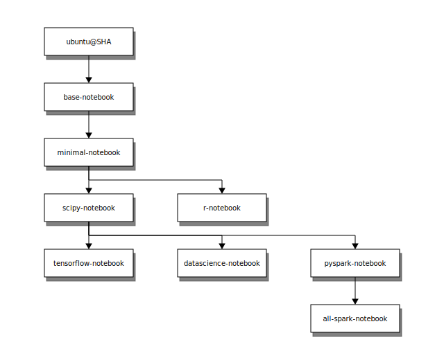

# Setup Instructions

This file gives an overview and step-by-step instructions for setting up JupyterLab using Docker. These instructions use [jupyter/docker-stacks](https://github.com/jupyter/docker-stacks) which offer stacks of ready-to-run Jupyter applications in Docker.

They are available in a number of different configurations that form a hierarchical dependence structure. Here's a diagram of the `FROM` relationships between all of the images defined in the project:

[](http://interactive.blockdiag.com/?compression=deflate&src=eJyFzTEPgjAQhuHdX9Gws5sQjGzujsaYKxzmQrlr2msMGv-71K0srO_3XGud9NNA8DSfgzESCFlBSdi0xkvQAKTNugw4QnL6GIU10hvX-Zh7Z24OLLq2SjaxpvP10lX35vCf6pOxELFmUbQiUz4oQhYzMc3gCrRt2cWe_FKosmSjyFHC6OS1AwdQWCtyj7sfh523_BI9hKlQ25YdOFdv5fcH0kiEMA)

## Step-by-Step Instructions

1. Update the installed packages and package cache on your instance:

    ```sudo yum update```

2. Install the most recent Docker Community Edition package:

    ```sudo yum install -y docker```

3. Start the Docker service:

    ```sudo service docker start```

4. Add the `ec2-user` to the docker group so you can execute Docker commands without using `sudo`:

    ```sudo usermod -a -G docker ec2-user```

5. Log out and log back in again to pick up the new docker group permissions.
6. Verify that the `ec2-user` can run Docker commands without `sudo`:

    ```docker info```

7. Open Port `1234` on your EC2 instance.

8. Run docker image:

    ```
    docker run -it --rm \
        -v "/home/ec2-user/notebooks":"/home/jovyan" \
        -p 1234:8888 \
        jupyter/scipy-notebook
        start.sh jupyter lab \
            --NotebookApp.password='sha1:123..321'
            
    ```

9. Your JupyterLab should now be accessible at ```http://ec2-12-34-45-67.compute-1.amazonaws.com:1234/```.
